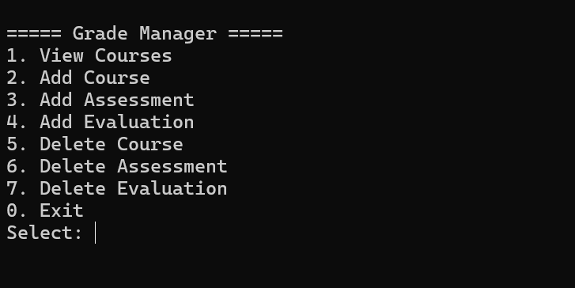
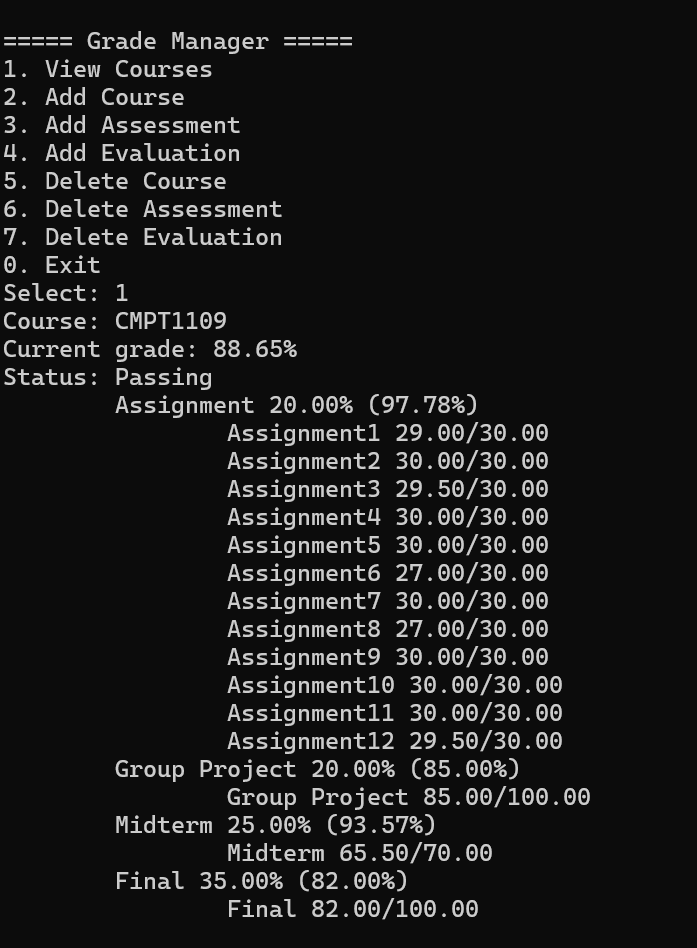

# GradeManager

GradeManager is a C++ console application for managing course grades using SQLite.

The application allows users to create courses, add assessments and evaluations, calculate current grades, and manage grade data through a simple menu-driven interface.

## Features

* Create and manage courses
* Set a passing grade for each course
* Add assessments with customizable weights
* Add evaluations with earned and possible scores
* Automatically calculate the current course grade
* Display course, assessment, and evaluation details
* Delete courses, assessments, and evaluations
* Update existing assessments and evaluations
* Store grade data in a SQLite database
* Validate user input

## Screenshots

### Main Menu



### View Courses



## Technologies

* **C++**
* **SQLite**
* **Visual Studio**
* **SQL**

## Project Structure

```text
GradeManager/
├── GradeManager.sln
└── GradeManager/
    ├── main.cpp
    ├── Menu.h
    ├── Menu.cpp
    ├── Course.h
    ├── Course.cpp
    ├── Assessment.h
    ├── Assessment.cpp
    ├── Evaluation.h
    ├── Evaluation.cpp
    ├── DatabaseManager.h
    ├── DatabaseManager.cpp
    ├── sqlite3.c
    └── sqlite3.h
```

## Class Structure

The application is organized into several classes:

```text
Course
 └── Assessment
      └── Evaluation
```

* **Course** manages a course and its assessments.
* **Assessment** represents an assessment category and its weight.
* **Evaluation** stores an individual result, such as an assignment or exam score.
* **DatabaseManager** handles communication with the SQLite database.
* **Menu** handles user interaction through the console.

## Grade Calculation

Each evaluation calculates its percentage based on the earned score and possible score.

For example:

```text
Earned Score: 18
Possible Score: 20

Percentage = 18 / 20 = 90%
```

The average percentage of the evaluations is used to calculate the weighted contribution of each assessment.

The current course grade is calculated by adding the weighted scores of all assessments.

## Database

GradeManager uses SQLite to store:

* Courses
* Assessments
* Evaluations

The database file `grades.db` is created locally when the application runs.

The database file is excluded from Git using `.gitignore` and is therefore not included in the GitHub repository.

## Input Validation

The application validates user input, including:

* Passing grades must be between 0 and 100
* Assessment weights must be between 0 and 100
* Possible scores must be greater than 0
* Earned scores must be between 0 and the possible score
* Invalid numeric input is detected and handled

## How to Run

1. Clone the repository.
2. Open `GradeManager.sln` in Visual Studio.
3. Build the solution.
4. Run the application.
5. The SQLite database will be created automatically.

## Purpose

This project was created to practice C++ programming, object-oriented programming, SQLite database management, SQL, and software project organization.

It also demonstrates the use of a database-driven design instead of storing grade data directly in the program's source code.
